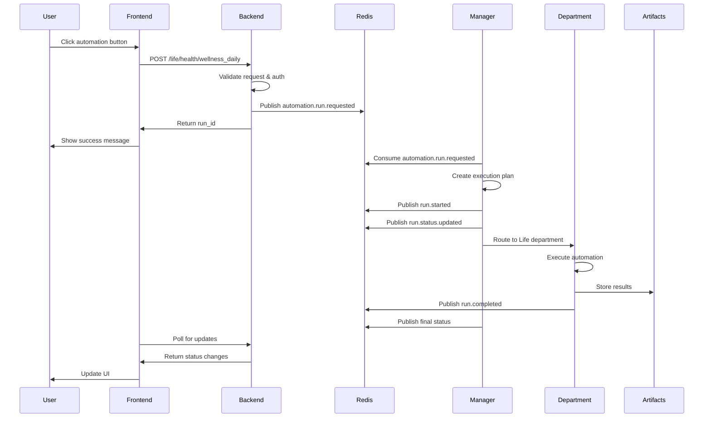

# AI Business Engine Architecture

## Overview

The AI Business Engine is a complete autonomous business automation platform that replaces
traditional business roles with AI agents, handling everything from idea generation to deployment
and scaling. This document provides a detailed breakdown of the system architecture, components, and
data flow.

## Core Architecture

### High-Level Components

```
┌─────────────────┐    ┌─────────────────┐    ┌─────────────────┐
│   Frontend      │    │   Backend API   │    │   Manager       │
│   (Next.js)     │◄──►│   (FastAPI)     │◄──►│   Orchestrator  │
└─────────────────┘    └─────────────────┘    └─────────────────┘
         │                       │                       │
         │                       │                       │
         ▼                       ▼                       ▼
┌─────────────────┐    ┌─────────────────┐    ┌─────────────────┐
│   Redis         │    │   Database      │    │   AI Agents     │
│   (Event Bus)   │    │   (SQLAlchemy)  │    │   (Departments) │
└─────────────────┘    └─────────────────┘    └─────────────────┘
         │                       │                       │
         │                       │                       │
         ▼                       ▼                       ▼
┌─────────────────┐    ┌─────────────────┐    ┌─────────────────┐
│   Prometheus    │    │   Grafana       │    │   Artifacts     │
│   (Metrics)     │    │   (Dashboards)  │    │   (Storage)     │
└─────────────────┘    └─────────────────┘    └─────────────────┘
```

## Component Details

### 1. Frontend (Next.js + TypeScript)

**Purpose**: User interface for interacting with the AI Business Engine

**Key Features**:

- **Dashboard**: Overview of AI departments, task catalog, and recent runs
- **Runs Console**: Monitor automation execution with live updates
- **Life Automation Triggers**: Direct access to personal automation endpoints
- **Manager Health Monitoring**: Real-time status of the orchestrator

**Technology Stack**:

- Next.js 14 with App Router
- TypeScript for type safety
- Tailwind CSS for styling
- Playwright for E2E testing

**Key Pages**:

- `/` - Landing page
- `/dashboard` - Main AI Business Engine dashboard
- `/runs` - Automation runs monitoring
- `/life/*` - Life automation endpoints

### 2. Backend API (FastAPI + SQLAlchemy)

**Purpose**: Core business logic and data management

**Key Features**:

- **RESTful API**: Comprehensive endpoints for all operations
- **Authentication & Authorization**: JWT-based with scope-based RBAC
- **Event Publishing**: Redis Streams integration for automation events
- **Database Management**: SQLAlchemy ORM with Alembic migrations

**Technology Stack**:

- FastAPI for high-performance API
- SQLAlchemy for database operations
- Pydantic for data validation
- Redis for event bus and caching

**Key Endpoints**:

- `/life/*` - Life automation triggers
- `/runs/*` - Run management and monitoring
- `/departments/*` - AI department information
- `/health` - Service health checks
- `/metrics` - Prometheus metrics

### 3. Manager Orchestrator

**Purpose**: Central coordination and planning of automation execution

**Key Features**:

- **Event Consumption**: Processes Redis Streams events
- **Rule-based Planning**: Generates execution plans based on intent
- **Department Routing**: Routes tasks to appropriate AI departments
- **Status Management**: Tracks and updates run status

**Technology Stack**:

- Python with Redis client
- Rule-based planning engine
- Prometheus metrics export
- Health endpoint for monitoring

**Key Functions**:

- `consume_events()` - Main event processing loop
- `create_plan()` - Generate execution plans
- `infer_department()` - Route to appropriate department
- `emit_status_events()` - Update run status

### 4. AI Department System

**Purpose**: Specialized automation domains with specific capabilities

**Departments**:

1. **Life**: Personal automation (health, nutrition, home, transport, learning)
2. **Finance**: Financial management (investments, bills, budgeting, trading)
3. **Safety**: Security and monitoring (security sweeps, compliance)
4. **Business**: Business operations (marketing, sales, strategy)
5. **Research**: Analysis and investigation (market research, trend analysis)
6. **Engineering**: Development and deployment (code, testing, infrastructure)

**Task Catalog**:

- Structured task definitions with complexity and duration
- Dependency mapping between tasks
- Priority and resource requirements

### 5. Event Processing Engine (Redis Streams)

**Purpose**: Reliable, asynchronous communication between components

**Key Features**:

- **Consumer Groups**: Prevents infinite loops and ensures reliability
- **Event Types**: Structured domain events with correlation IDs
- **Dead Letter Queues**: Handles failed event processing
- **Idempotency**: Prevents duplicate execution

**Event Flow**:

```
User Action → Backend → automation.run.requested → Manager → run.started → run.status.updated → run.completed
```

**Key Events**:

- `automation.run.requested` - Initial automation request
- `run.started` - Execution begins
- `run.status.updated` - Status change
- `run.completed` - Successful completion
- `run.failed` - Execution failure

### 6. Data Layer (SQLAlchemy + Alembic)

**Purpose**: Persistent storage and data management

**Key Models**:

- **User**: Authentication and user management
- **AgentRun**: Automation execution tracking
- **Artifact**: Output and result storage
- **Lead/Task**: Business process management

**Database Support**:

- **Development**: SQLite with automatic migrations
- **Production**: PostgreSQL with Alembic migrations
- **Schema Management**: Automatic column addition for development

### 7. Observability Stack

**Purpose**: Monitoring, alerting, and operational visibility

**Components**:

- **Prometheus**: Metrics collection and storage
- **Grafana**: Visualization and dashboards
- **Jaeger**: Distributed tracing (optional)
- **Alertmanager**: Alert routing and management

**Key Metrics**:

- **API Performance**: Request rate, latency (p50/p95), error rate
- **Orchestrator Health**: Redis Stream lag, queue depth, reprocessing
- **Manager Health**: Planning duration, step count, failure reasons
- **Agent Metrics**: Token usage, costs, latency (Batch E)

**Dashboards**:

- **API SLO**: Performance and error monitoring
- **Orchestrator**: Redis Streams and queue health
- **Manager Health**: Planning and execution metrics

## Data Flow

### 1. Automation Request Flow



### 2. Event Processing Flow

```
1. User Action
   ↓
2. Backend Validation & Auth
   ↓
3. Event Publishing (Redis Streams)
   ↓
4. Manager Consumption
   ↓
5. Planning & Routing
   ↓
6. Department Execution
   ↓
7. Result Storage
   ↓
8. Status Updates
   ↓
9. UI Refresh
```

### 3. Data Persistence Flow

```
1. Event Received
   ↓
2. Database Transaction Start
   ↓
3. Model Updates
   ↓
4. Artifact Storage
   ↓
5. Status Updates
   ↓
6. Transaction Commit
   ↓
7. Metrics Recording
```

## Security Architecture

### Authentication

- **JWT Tokens**: HS256 algorithm with configurable expiration
- **Scope-based Access**: Fine-grained permission control
- **Secure Mode Toggle**: RBAC enforcement can be disabled for development

### Authorization

- **Required Scopes**: Each endpoint requires specific permissions
- **Role-based Access**: Admin, user, and department-specific roles
- **Correlation IDs**: Full traceability of all operations

### Data Protection

- **Input Validation**: Pydantic models for all data
- **SQL Injection Prevention**: SQLAlchemy ORM with parameterized queries
- **CORS Protection**: Configurable origin restrictions

## Performance & Scalability

### Current Capabilities

- **API Performance**: Sub-100ms response times for most operations
- **Concurrent Users**: Supports multiple simultaneous users
- **Event Processing**: Handles automation events in real-time

### Scaling Considerations

- **Horizontal Scaling**: Stateless API can be replicated
- **Database Scaling**: PostgreSQL with read replicas
- **Event Processing**: Multiple manager instances with consumer groups
- **Caching**: Redis for frequently accessed data

### Performance Monitoring

- **Real-time Metrics**: Prometheus with 10-second refresh
- **Latency Tracking**: P50, P95, and P99 percentiles
- **Error Rate Monitoring**: 4xx and 5xx error tracking
- **Resource Utilization**: CPU, memory, and database metrics

## Development & Deployment

### Local Development

- **Docker Compose**: Complete infrastructure stack
- **Hot Reloading**: Frontend and backend development servers
- **Database Migrations**: Automatic schema updates
- **Testing**: Comprehensive test suite with Playwright E2E

### Production Deployment

- **Containerization**: Docker images for all components
- **Kubernetes**: Orchestration and scaling (Batch G)
- **CI/CD**: GitHub Actions with automated testing
- **Monitoring**: Production-grade observability stack

### Testing Strategy

- **Unit Tests**: Backend logic and utilities
- **Integration Tests**: API endpoints and database operations
- **E2E Tests**: Complete user workflows
- **Load Tests**: Performance under stress
- **Security Tests**: Authentication and authorization

## Future Roadmap

### Batch E - AI Agent Integration

- **Live Agents**: Research department with market gap scanner
- **Cost Tracking**: Token usage and cost monitoring
- **Learning Systems**: Agent improvement over time

### Batch F - Advanced Automation

- **Dependency Graphs**: Visual task dependencies
- **Self-healing**: Automatic failure recovery
- **Advanced Planning**: ML-based execution planning

### Batch G - Production Scaling

- **Kubernetes**: Production orchestration
- **High Availability**: Multi-region deployment
- **Advanced SLOs**: Service level objectives and alerts

## Conclusion

The AI Business Engine provides a solid foundation for autonomous business automation with:

- **Reliable Architecture**: Event-driven design with Redis Streams
- **Comprehensive Security**: JWT-based authentication with scope-based authorization
- **Full Observability**: Prometheus metrics and Grafana dashboards
- **Scalable Design**: Stateless components with horizontal scaling support
- **Developer Experience**: Comprehensive testing and local development setup

This architecture enables the transformation from manual business processes to fully automated,
AI-driven operations while maintaining reliability, security, and observability.
